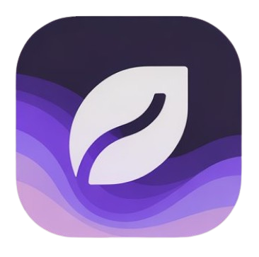

<div align="center">



# Gaia Portal

Documentação interativa do ecossistema Gaia, construída com Astro + Starlight para apresentar hardware, portal educacional e painel Gaia Web.

</div>

---

## 🧭 Índice

- [Visão Geral](#-visão-geral)
- [Principais Recursos](#-principais-recursos)
- [Stack Principal](#-stack-principal)
- [Pré-requisitos](#-pré-requisitos)
- [Configuração](#-configuração)
- [Scripts Disponíveis](#-scripts-disponíveis)
- [Estrutura de Pastas](#-estrutura-de-pastas)
- [Conteúdo Destacado](#-conteúdo-destacado)
- [Contribuição](#-contribuição)
- [Licença](#-licença)

---

## ⚙️ Visão Geral

Este repositório hospeda o **Gaia Portal**, site que centraliza toda a documentação do Programa Gaia: visão geral, hardware, portal web, painel operacional (Gaia Web) e guias educacionais multilíngues. Foi criado para apoiar escolas, comunidades e equipes técnicas que desejam adotar ou colaborar com o projeto.

---

## 🚀 Principais Recursos

- **Landing rica** com Hero animado, componentes React personalizados e seções editáveis via Markdown.
- **Documentação Starlight** com navegação lateral automática, suporte a múltiplos idiomas (pt-BR e fr) e busca integrada.
- **Componentes Override** (Hero, Header, CTA, etc.) para alinhar visual à identidade do projeto.
- **Seções educacionais** destacando hardware, propósito social e passo a passo de adoção.
- **Integração React + Three.js** para animações de destaque.

---

## 🛠️ Stack Principal

- [Astro 5](https://astro.build/) com [Starlight](https://starlight.astro.build/)
- [React 19](https://react.dev/) para componentes interativos
- [Tailwind CSS 4](https://tailwindcss.com/) + [Starlight Tailwind](https://github.com/tailwindlabs/tailwindcss-astro)
- [Three.js](https://threejs.org/) e [Framer Motion](https://www.framer.com/motion/) para efeitos visuais
- TypeScript, ESLint, Husky e Commitlint para qualidade

---

## 🧱 Pré-requisitos

- Node.js **>= 20**
- npm **>= 10** (ou compatível via `corepack`)
- CLI do Git instalada

> Dica: o projeto usa caminhos absolutos com `~/`, então ambientes de desenvolvimento devem respeitar o `tsconfig.json`.

---

## 🧾 Configuração

```bash
git clone https://github.com/ctrI-Alt-Del/gaia-portal.git
cd gaia-portal
npm install
```

Para rodar localmente:

```bash
npm run dev
```

Abra `http://localhost:4321` (porta padrão do Astro) para visualizar. Ajuste variáveis em `.env` caso utilize fontes remotas adicionais (por exemplo, Whisper/Embeds no futuro).

---

## 💻 Scripts Disponíveis

| Comando             | Descrição                                                                 |
| ------------------- | ------------------------------------------------------------------------- |
| `npm run dev`       | Servidor Astro com HMR.                                                    |
| `npm run build`     | Gera a versão estática/SSR para deploy.                                    |
| `npm run preview`   | Servidor local para inspecionar o build final.                             |
| `npm run start`     | Alias para `astro dev` (ambientes simples).                                |
| `npm run prepare`   | Instala hooks do Husky (executado automaticamente após `npm install`).     |

---

## 📁 Estrutura de Pastas

```
src/
  components/                 # Componentes base e overrides do tema
  content/                    # Conteúdo Markdown/MDX (docs e seções)
  config/                     # Configuração específica do portal (menus, branding)
  assets/                     # Logos, ícones, ilustrações
documentation/                # Guias adicionais (arquitetura, PRD, convenções)
public/                       # Assets estáticos (logos, favicons)
```

- `src/content/docs/getting-started/introduction/` reúne os capítulos do guia inicial (Visão Geral, Hardware, Portal, Propósito Educacional, Gaia Web, etc.).
- `src/components/override-components/` contém substituições do tema Starlight utilizadas na landing.
- `src/config/menu.en.json` e `src/config/sidebar.json` mantêm menus principal e lateral do site.

---

## 📚 Conteúdo Destacado

- **Visão Geral do Projeto** (`/getting-started/introduction/01-visao-geral`) – Problema, solução e público.
- **Hardware Gaia** (`02-hardware`) – Detalha sensores, montagem e fluxo de dados.
- **Portal Gaia** (`03-portal`) – Estrutura e objetivos da landing pública.
- **Propósito Educacional** (`04-proposito-educacional`) – Impacto social e uso pedagógico.
- **Gaia Web (Painel)** (`05-gaia-web`) – Manual completo do painel full-stack, incluindo arquitetura, pipelines e próximos passos.
- **Sobre o Projeto** (`/about`) – História da equipe e motivação.

Todos os capítulos estão em português e parte deles em francês (`src/content/docs/fr/**`), facilitando uso em diferentes comunidades.

---

## 🤝 Contribuição

1. Abra uma *issue* descrevendo o contexto.
2. Crie uma branch a partir de `main`.
3. Execute `npm run dev` para testes locais; rode `npm run build` antes do PR.
4. Commits devem seguir o padrão do Commitlint (ex.: `feat: adiciona seção de alertas`).
5. Envie o PR com screenshots ou GIFs quando alterar UI.

Sugestões de melhorias são bem-vindas, especialmente em conteúdo educacional, internacionalização e exemplos práticos para escolas.

---

## 📄 Licença

Distribuído sob licença **MIT**. Consulte o arquivo [`LICENSE`](LICENSE) para mais detalhes.
